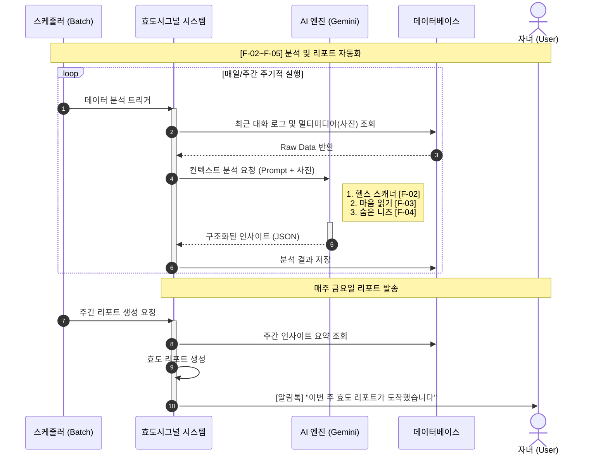

# 효도시그널 완전 구현 계획 (전체 Mermaid 통합)

기획서 + 모든 Mermaid 플로우를 완전 통합한 최종 구현 계획입니다.

---

## 📊 핵심 발견사항 (추가된 내용)

### 새로 추가된 요구사항
1. ✅ **멀티미디어(사진) 분석** - 대화뿐만 아니라 사진도 AI로 분석
2. ✅ **구조화된 JSON 응답** - AI가 정형화된 JSON 형태로 인사이트 반환
3. ✅ **알림톡 발송** - 매주 금요일 리포트 생성 후 알림톡 전송
4. ✅ **Raw Data 처리** - DB에서 조회한 원본 데이터를 AI에 전달

---

## 🎯 통합 플로우: 분석 및 리포트 자동화



---

## 🆕 추가 구현 사항

### 1. 사진 분석 기능 (멀티미디어)

#### Message 도메인 확장
```java
Message {
    id: Long
    conversationId: Long
    senderMemberId: Long
    content: String
    messageType: MessageType (TEXT/IMAGE/FILE)

    // 🆕 이미지 관련 필드
    imageUrl: String        // 이미지 URL
    imageDescription: String // AI가 분석한 이미지 설명

    sentAt: LocalDateTime
}

enum MessageType {
    TEXT,   // 텍스트
    IMAGE,  // 이미지 (주요!)
    FILE    // 기타 파일
}
```

#### Gemini Vision API 활용
```java
@Service
public class GeminiAnalysisService {

    /**
     * 사진 분석 - Gemini Vision API 사용
     */
    public String analyzeImage(String imageUrl) {
        String prompt = """
            이 사진을 분석해서 다음을 설명해주세요:
            1. 사진 속 상황 (어디서, 무엇을)
            2. 부모님의 활동 (등산, 모임, 집 등)
            3. 건강 관련 단서 (옷차림, 표정, 자세 등)
            4. 대화 주제로 쓸 만한 요소

            JSON 형식:
            {
              "scene": "등산로에서 단풍 배경",
              "activity": "등산",
              "healthClue": "활동적이고 건강해 보임",
              "conversationTopic": "단풍이 참 예쁘네요"
            }
            """;

        GeminiVisionRequest request = GeminiVisionRequest.builder()
            .prompt(prompt)
            .imageUrl(imageUrl)
            .build();

        GeminiResponse response = geminiClient.generateWithImage(request);
        return parseImageAnalysis(response);
    }

    /**
     * 텍스트 + 이미지 통합 분석
     */
    public List<Insight> analyzeWithImages(
            List<Message> messages,
            List<Message> images) {

        // 1. 텍스트 분석
        HealthInsight health = analyzeHealth(messages);
        EmotionInsight emotion = analyzeEmotion(messages);
        NeedsInsight needs = analyzeNeeds(messages);

        // 2. 이미지 분석 결과 통합
        for (Message image : images) {
            String imageAnalysis = analyzeImage(image.getImageUrl());

            // 이미지에서 추가 인사이트 추출
            enhanceInsightWithImage(health, emotion, needs, imageAnalysis);
        }

        return List.of(health, emotion, needs);
    }
}
```

#### 이미지 업로드 API
```http
POST   /api/conversations/{id}/messages/image    # 이미지 메시지 업로드
```

**Request**:
```json
{
  "senderMemberId": 123,
  "imageUrl": "https://...",
  "sentAt": "2024-01-15T10:30:00"
}
```

---

### 2. 구조화된 JSON 응답 포맷

#### AI 응답 표준 포맷
```java
/**
 * AI가 반환하는 표준 JSON 포맷
 */

// 헬스 스캐너 응답
record HealthAnalysisResponse(
    List<String> keywords,           // ["무릎", "허리", "두통"]
    List<String> bodyParts,          // ["무릎", "허리"]
    String severity,                 // "MEDIUM"
    int mentionCount,                // 5 (언급 횟수)
    String description,              // "무릎 통증 호소 증가"
    String recommendation,           // "정형외과 검진 권유"
    List<String> relatedMessages     // 근거 메시지 ID들
) {}

// 감정 분석 응답
record EmotionAnalysisResponse(
    String emotionType,              // "LONELY"
    int score,                       // 45 (0-100)
    String description,              // "외로움 표현 증가"
    List<String> evidence,           // ["혼자 심심해", "애들이 안 와"]
    Map<String, Integer> emotionBreakdown  // {"lonely": 45, "sad": 30, "neutral": 25}
) {}

// 니즈 발굴 응답
record NeedsAnalysisResponse(
    String category,                 // "건강"
    List<NeedsItem> items,
    String priority,                 // "HIGH"
    String description,              // "무릎 통증 관련 용품 필요"
    List<String> giftKeywords        // ["찜질기", "무릎보호대"]
) {}

record NeedsItem(
    String name,                     // "온열 찜질기"
    String reason,                   // "무릎 통증 호소"
    String giftLink                  // 카카오 선물하기 URL
) {}
```

#### Gemini 프롬프트 (JSON 강제)
```java
private String buildHealthPromptWithJson(List<Message> messages) {
    return """
        다음 대화를 분석해서 **반드시 JSON 형식으로만** 답변해주세요.

        대화:
        %s

        **응답 형식 (JSON만):**
        ```json
        {
          "keywords": ["무릎", "허리"],
          "bodyParts": ["무릎", "허리"],
          "severity": "MEDIUM",
          "mentionCount": 5,
          "description": "최근 무릎 통증 호소가 증가했습니다.",
          "recommendation": "정형외과 검진을 권유하세요.",
          "relatedMessages": ["msg_123", "msg_456"]
        }
        ```

        **중요**:
        - 반드시 위 JSON 형식을 정확히 지켜주세요
        - 다른 설명 없이 JSON만 반환하세요
        - severity는 LOW/MEDIUM/HIGH 중 하나
        """.formatted(formatMessages(messages));
}
```

#### JSON 파싱 서비스
```java
@Service
public class InsightParserService {

    private final ObjectMapper objectMapper;

    /**
     * Gemini 응답을 구조화된 객체로 파싱
     */
    public HealthInsight parseHealthResponse(String jsonResponse) {
        try {
            // JSON 추출 (코드 블록 제거)
            String cleanJson = extractJson(jsonResponse);

            HealthAnalysisResponse response = objectMapper
                .readValue(cleanJson, HealthAnalysisResponse.class);

            return HealthInsight.builder()
                .keywords(String.join(",", response.keywords()))
                .bodyParts(String.join(",", response.bodyParts()))
                .severity(Severity.valueOf(response.severity()))
                .mentionCount(response.mentionCount())
                .description(response.description())
                .recommendation(response.recommendation())
                .build();

        } catch (JsonProcessingException e) {
            log.error("Failed to parse health insight: {}", e.getMessage());
            throw new RuntimeException("AI 응답 파싱 실패", e);
        }
    }

    /**
     * JSON 코드 블록 추출
     */
    private String extractJson(String response) {
        // ```json ... ``` 제거
        return response
            .replaceAll("```json\\s*", "")
            .replaceAll("```\\s*", "")
            .trim();
    }
}
```

---

### 3. 알림톡 발송 시스템

#### 알림 도메인
```java
// notification 도메인 (새로 추가)
Notification {
    id: Long
    familyId: Long
    recipientMemberId: Long  // 수신자 (자녀)

    // 알림 정보
    notificationType: NotificationType
    title: String
    message: String

    // 관련 엔티티
    relatedEntityType: String  // "WEEKLY_REPORT", "EMERGENCY_ALERT"
    relatedEntityId: Long

    // 발송 상태
    status: NotificationStatus (PENDING/SENT/FAILED)
    sentAt: LocalDateTime

    createdAt: LocalDateTime
}

enum NotificationType {
    WEEKLY_REPORT,      // 주간 리포트
    EMERGENCY_ALERT,    // 긴급 알림
    CONVERSATION_GAP    // 대화 단절
}

enum NotificationStatus {
    PENDING,   // 대기
    SENT,      // 발송 완료
    FAILED     // 발송 실패
}
```

#### 알림톡 서비스
```java
@Service
public class NotificationService {

    /**
     * 주간 리포트 알림톡 발송
     */
    public void sendWeeklyReportNotification(WeeklyReport report) {
        FamilyMember child = familyMemberRepository
            .findChildByFamily(report.getFamilyId());

        String message = buildWeeklyReportMessage(report);

        Notification notification = Notification.builder()
            .familyId(report.getFamilyId())
            .recipientMemberId(child.getId())
            .notificationType(NotificationType.WEEKLY_REPORT)
            .title("이번 주 효도 리포트가 도착했습니다")
            .message(message)
            .relatedEntityType("WEEKLY_REPORT")
            .relatedEntityId(report.getId())
            .status(NotificationStatus.PENDING)
            .build();

        notificationRepository.save(notification);

        // 실제 알림톡 발송 (비동기)
        sendKakaoAlimtalk(notification);
    }

    /**
     * 긴급 알림톡 발송
     */
    public void sendEmergencyNotification(EmergencyAlert alert) {
        FamilyMember child = familyMemberRepository
            .findById(alert.getChildMemberId())
            .orElseThrow();

        String message = buildEmergencyMessage(alert);

        Notification notification = Notification.builder()
            .familyId(alert.getFamilyId())
            .recipientMemberId(child.getId())
            .notificationType(NotificationType.EMERGENCY_ALERT)
            .title("🚨 긴급 리포트")
            .message(message)
            .relatedEntityType("EMERGENCY_ALERT")
            .relatedEntityId(alert.getId())
            .status(NotificationStatus.PENDING)
            .build();

        notificationRepository.save(notification);
        sendKakaoAlimtalk(notification);
    }

    /**
     * 카카오 알림톡 발송
     */
    @Async
    private void sendKakaoAlimtalk(Notification notification) {
        try {
            // TODO: 실제 카카오 알림톡 API 연동
            // 현재는 로그만 출력
            log.info("📤 알림톡 발송: {}", notification.getTitle());
            log.info("   수신자: {}", notification.getRecipientMemberId());
            log.info("   내용: {}", notification.getMessage());

            notification.markAsSent();
            notificationRepository.save(notification);

        } catch (Exception e) {
            log.error("알림톡 발송 실패: {}", e.getMessage());
            notification.markAsFailed();
            notificationRepository.save(notification);
        }
    }

    /**
     * 주간 리포트 메시지 생성
     */
    private String buildWeeklyReportMessage(WeeklyReport report) {
        return """
            안녕하세요 👋

            이번 주 부모님의 효도 리포트가 도착했습니다.

            📊 이번 주 요약:
            • 건강: %s
            • 감정: %s
            • 추천 선물: %s

            자세한 내용은 앱에서 확인하세요!
            """.formatted(
                summarizeHealth(report),
                summarizeEmotion(report),
                summarizeNeeds(report)
            );
    }

    /**
     * 긴급 알림 메시지 생성
     */
    private String buildEmergencyMessage(EmergencyAlert alert) {
        return """
            🚨 긴급 알림

            %s

            부모님께 즉시 연락 부탁드립니다.
            """.formatted(alert.getAiAnalysis());
    }
}
```

#### 알림 API
```http
GET    /api/notifications/my              # 내 알림 목록
GET    /api/notifications/{id}            # 알림 상세
POST   /api/notifications/{id}/read       # 알림 읽음 처리
```

---

### 4. Raw Data 처리 로직

#### 대화 데이터 수집 서비스
```java
@Service
public class ConversationDataService {

    /**
     * 최근 대화 로그 및 멀티미디어 조회
     */
    public RawConversationData collectRecentData(Long familyId, int days) {
        LocalDateTime since = LocalDateTime.now().minusDays(days);

        // 텍스트 메시지 조회
        List<Message> textMessages = messageRepository
            .findByFamilyIdAndTypeAndSentAtAfter(
                familyId,
                MessageType.TEXT,
                since
            );

        // 이미지 메시지 조회
        List<Message> imageMessages = messageRepository
            .findByFamilyIdAndTypeAndSentAtAfter(
                familyId,
                MessageType.IMAGE,
                since
            );

        return RawConversationData.builder()
            .familyId(familyId)
            .textMessages(textMessages)
            .imageMessages(imageMessages)
            .collectedAt(LocalDateTime.now())
            .build();
    }
}

/**
 * Raw Data 컨테이너
 */
record RawConversationData(
    Long familyId,
    List<Message> textMessages,
    List<Message> imageMessages,
    LocalDateTime collectedAt
) {
    public int getTotalMessageCount() {
        return textMessages.size() + imageMessages.size();
    }

    public boolean hasImages() {
        return !imageMessages.isEmpty();
    }
}
```

---

## 🔄 통합 분석 플로우 (업데이트)

### 스케줄러 구현
```java
@Configuration
@EnableScheduling
public class AnalysisScheduler {

    private final ConversationDataService dataService;
    private final GeminiAnalysisService analysisService;
    private final InsightService insightService;
    private final NotificationService notificationService;

    /**
     * 매일 자정 - 일일 분석
     */
    @Scheduled(cron = "0 0 0 * * *")
    public void runDailyAnalysis() {
        log.info("⏰ 일일 분석 시작");

        List<Family> families = familyRepository.findAllActive();

        for (Family family : families) {
            try {
                // 1. Raw Data 수집 (최근 1일)
                RawConversationData data = dataService
                    .collectRecentData(family.getId(), 1);

                if (data.getTotalMessageCount() == 0) {
                    log.info("가족 {} - 분석할 메시지 없음", family.getId());
                    continue;
                }

                // 2. AI 분석 (텍스트 + 이미지)
                HealthInsight health = analysisService
                    .analyzeHealth(data.textMessages());
                EmotionInsight emotion = analysisService
                    .analyzeEmotion(data.textMessages());
                NeedsInsight needs = analysisService
                    .analyzeNeeds(data.textMessages());

                // 이미지가 있으면 추가 분석
                if (data.hasImages()) {
                    analysisService.enhanceWithImages(
                        List.of(health, emotion, needs),
                        data.imageMessages()
                    );
                }

                // 3. 인사이트 저장
                insightService.save(health);
                insightService.save(emotion);
                insightService.save(needs);

                log.info("✅ 가족 {} 일일 분석 완료", family.getId());

            } catch (Exception e) {
                log.error("가족 {} 분석 실패: {}", family.getId(), e.getMessage());
            }
        }

        log.info("✅ 일일 분석 완료");
    }

    /**
     * 매주 금요일 오후 3시 - 주간 리포트 생성
     */
    @Scheduled(cron = "0 0 15 * * FRI")
    public void generateWeeklyReports() {
        log.info("⏰ 주간 리포트 생성 시작");

        List<Family> families = familyRepository.findAllActive();

        for (Family family : families) {
            try {
                // 1. 주간 리포트 생성
                WeeklyReport report = weeklyReportService
                    .generateReport(family.getId());

                // 2. 알림톡 발송
                notificationService
                    .sendWeeklyReportNotification(report);

                log.info("✅ 가족 {} 주간 리포트 발송", family.getId());

            } catch (Exception e) {
                log.error("가족 {} 리포트 생성 실패: {}", family.getId(), e.getMessage());
            }
        }

        log.info("✅ 주간 리포트 발송 완료");
    }
}
```

---

## 📋 업데이트된 구현 우선순위

### Day 1: 기본 구조 (7시간)
```
✅ 1. Family & FamilyMember
✅ 2. Conversation & Message
   🆕 - MessageType.IMAGE 지원
   🆕 - imageUrl, imageDescription 필드
```

### Day 2: AI 분석 ⭐ (8시간)
```
✅ 3. Gemini API 연동
   🆕 - Vision API (이미지 분석)
   🆕 - 구조화된 JSON 응답

✅ 4. 3가지 인사이트 분석
   🆕 - 텍스트 + 이미지 통합 분석
   🆕 - JSON 파싱 서비스
```

### Day 3: 리포트 & 알림 (6시간)
```
✅ 5. 주간 리포트 생성
✅ 6. 대화 치트키 & 선물 추천
   🆕 - 알림톡 시스템 구현
   🆕 - Notification 도메인
```

### Day 4: 긴급 알림 (4시간)
```
✅ 7. 긴급 알림 감지
   🆕 - 긴급 알림톡 발송
```

---

## 🆕 추가된 도메인

```
notification/        # 알림 도메인 (NEW!)
├── domain/
│   └── Notification.java
├── repository/
└── service/
    └── NotificationService.java
```

---

## 🔧 추가 설정

### build.gradle
```gradle
// JSON 파싱
implementation 'com.fasterxml.jackson.core:jackson-databind'
implementation 'com.google.code.gson:gson:2.10.1'

// 비동기 처리
implementation 'org.springframework.boot:spring-boot-starter-webflux'

// 이미지 처리 (선택)
implementation 'org.springframework.boot:spring-boot-starter-web'
```

### application-secret.properties
```properties
# Gemini API (Vision 포함)
gemini.api-key=YOUR_API_KEY
gemini.model=gemini-1.5-flash
gemini.vision-model=gemini-1.5-flash  # Vision API도 동일
gemini.api-url=https://generativelanguage.googleapis.com/v1beta/models

# 카카오 알림톡 (추후)
kakao.alimtalk.api-key=YOUR_ALIMTALK_KEY
kakao.alimtalk.sender-key=YOUR_SENDER_KEY
```

---

## 🚀 최종 체크리스트

### 필수 설정
- [ ] Gemini API Key 발급
- [ ] Vision API 활성화 확인
- [ ] 스케줄러 설정 (일일/주간)
- [ ] 알림톡 템플릿 준비 (선택)

### 구현 순서
- [ ] Day 1: 기본 구조 (이미지 필드 포함)
- [ ] Day 2: AI 분석 (텍스트 + 이미지)
- [ ] Day 3: 리포트 & 알림톡
- [ ] Day 4: 긴급 알림

---

## 💡 다음 단계

준비되셨으면:
1. **"Day 1 시작"** - 기본 구조부터
2. **"Day 2 시작"** - AI 분석부터 (추천)
3. **"스켈레톤"** - 전체 구조만

선택해주시면 바로 시작하겠습니다! 🚀
