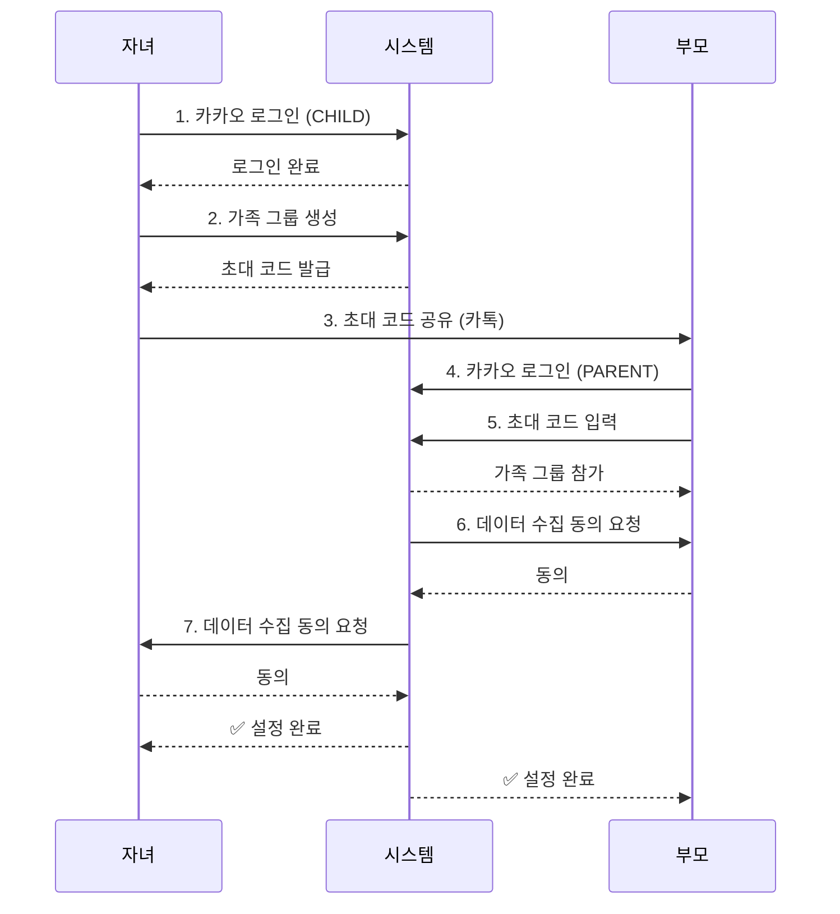
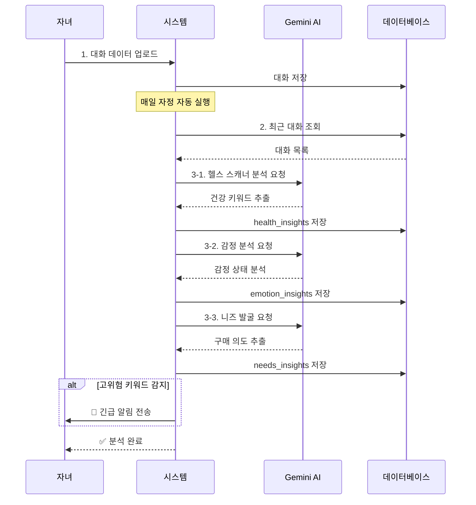
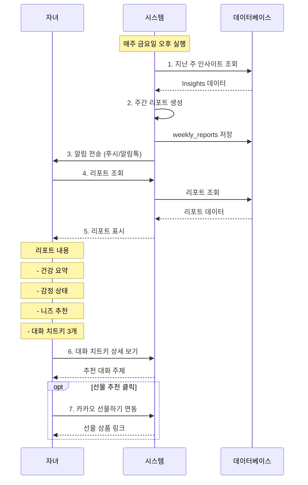
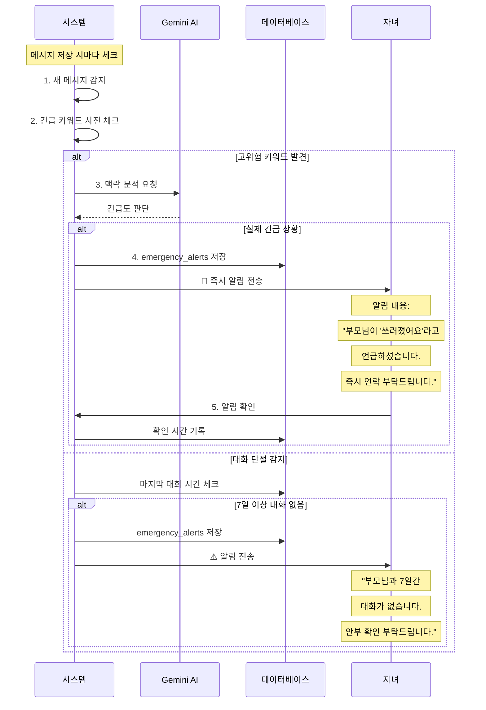

# 효도시그널 상세 구현 계획 (4가지 플로우 기반)

## 📊 전체 플로우 구조

```
1. 초기설정 플로우 - 가족 그룹 생성 및 연결
2. 분석 플로우 - AI 대화 분석 (실시간/스케줄)
3. 리포트 열람 플로우 - 주간 리포트 조회
4. 긴급 리포트 플로우 - 긴급 상황 알림
```

---

## 🎯 플로우 1: 초기설정 (Setup Flow)

### 목적
가족 구성원을 연결하고 대화 데이터 수집 동의를 받는 과정

### Mermaid 플로우


### 구현 항목

#### 도메인 모델
```java
// family 도메인
Family {
    id: Long
    name: String
    inviteCode: String (6자리 랜덤)
    createdBy: Long (자녀 userId)
    createdAt: LocalDateTime
    status: FamilyStatus (ACTIVE, INACTIVE)
}

FamilyMember {
    id: Long
    familyId: Long
    userId: Long
    role: MemberRole (PARENT, CHILD)
    nickname: String
    consentedAt: LocalDateTime (데이터 수집 동의 시간)
    joinedAt: LocalDateTime
}

enum MemberRole {
    PARENT,  // 부모
    CHILD    // 자녀
}
```

#### API 엔드포인트
```http
POST   /api/families                    # 가족 그룹 생성
POST   /api/families/join/{inviteCode}  # 초대 코드로 참가
POST   /api/families/{id}/consent       # 데이터 수집 동의
GET    /api/families/my                 # 내 가족 그룹 조회
GET    /api/families/{id}               # 가족 그룹 상세
PATCH  /api/families/{id}/members/{memberId} # 멤버 정보 수정
```

#### Request/Response DTO
```java
// 가족 그룹 생성 요청
record CreateFamilyRequest(
    String name
) {}

// 가족 그룹 생성 응답
record CreateFamilyResponse(
    Long familyId,
    String name,
    String inviteCode,
    LocalDateTime createdAt
) {}

// 초대 코드로 참가 요청
record JoinFamilyRequest(
    String inviteCode
) {}

// 데이터 수집 동의 요청
record ConsentRequest(
    boolean consented
) {}
```

---

## 🎯 플로우 2: 분석 (Analysis Flow)

### 목적
대화 데이터를 수집하고 Gemini AI로 분석하여 인사이트 추출

### Mermaid 플로우


### 구현 항목

#### 도메인 모델
```java
// conversation 도메인
Conversation {
    id: Long
    familyId: Long
    title: String
    platform: String (KAKAO_TALK)
    createdAt: LocalDateTime
}

Message {
    id: Long
    conversationId: Long
    senderId: Long (FamilyMember.id)
    content: String
    messageType: MessageType (TEXT, IMAGE, FILE)
    sentAt: LocalDateTime
}

// insight 도메인
HealthInsight {
    id: Long
    familyId: Long
    parentMemberId: Long
    keywords: List<String> (JSON)
    bodyParts: List<String> (무릎, 허리, 머리...)
    severity: Severity (LOW, MEDIUM, HIGH)
    description: String
    analyzedPeriod: String (2024-01-01 ~ 2024-01-07)
    createdAt: LocalDateTime
}

EmotionInsight {
    id: Long
    familyId: Long
    parentMemberId: Long
    emotionType: EmotionType (HAPPY, NEUTRAL, SAD, LONELY, ANXIOUS)
    score: Integer (0-100)
    description: String
    messageCount: Integer (분석한 메시지 수)
    analyzedPeriod: String
    createdAt: LocalDateTime
}

NeedsInsight {
    id: Long
    familyId: Long
    parentMemberId: Long
    category: String (음식, 건강, 의류, 취미...)
    items: List<String> (JSON)
    priority: Priority (HIGH, MEDIUM, LOW)
    description: String
    analyzedPeriod: String
    createdAt: LocalDateTime
}

enum Severity { LOW, MEDIUM, HIGH }
enum EmotionType { HAPPY, NEUTRAL, SAD, LONELY, ANXIOUS }
enum Priority { HIGH, MEDIUM, LOW }
```

#### API 엔드포인트
```http
# 대화 관리
POST   /api/conversations                 # 대화 업로드
POST   /api/conversations/{id}/messages   # 메시지 추가
GET    /api/conversations                 # 대화 목록
GET    /api/conversations/{id}            # 대화 상세

# 분석 실행 (수동 트리거)
POST   /api/analysis/run                  # 전체 분석 실행
POST   /api/analysis/health               # 헬스 분석만
POST   /api/analysis/emotion              # 감정 분석만
POST   /api/analysis/needs                # 니즈 분석만

# 인사이트 조회
GET    /api/insights/health/{familyId}    # 건강 인사이트
GET    /api/insights/emotion/{familyId}   # 감정 인사이트
GET    /api/insights/needs/{familyId}     # 니즈 인사이트
GET    /api/insights/latest/{familyId}    # 최신 인사이트 통합
```

#### Gemini API 프롬프트 템플릿

**헬스 스캐너 프롬프트**:
```
다음은 부모님과 자녀의 카카오톡 대화 내용입니다.
부모님의 건강 상태를 분석해주세요.

대화 내용:
{messages}

다음 형식으로 답변해주세요:
1. 건강 관련 키워드: (예: 무릎, 허리, 두통)
2. 언급된 신체 부위: (예: 무릎, 허리, 머리)
3. 심각도: (낮음/중간/높음)
4. 요약: (100자 이내)
5. 권장 조치: (구체적인 조언)
```

**감정 분석 프롬프트**:
```
다음은 부모님과 자녀의 대화 내용입니다.
부모님의 감정 상태를 분석해주세요.

대화 내용:
{messages}

다음 형식으로 답변해주세요:
1. 주요 감정: (기쁨/평온/슬픔/외로움/불안)
2. 감정 점수: (0-100, 높을수록 긍정적)
3. 요약: (부모님의 현재 심리 상태 100자 이내)
4. 근거: (감정을 판단한 대화 내용)
```

**니즈 발굴 프롬프트**:
```
다음은 부모님과 자녀의 대화 내용입니다.
부모님이 필요로 하거나 관심 있어하는 물건/서비스를 찾아주세요.

대화 내용:
{messages}

다음 형식으로 답변해주세요:
1. 카테고리: (음식/건강/의류/취미/기타)
2. 구체적 항목: (예: 보양식, 무릎 보호대, 따뜻한 옷)
3. 우선순위: (높음/중간/낮음)
4. 근거: (어떤 대화에서 추출했는지)
5. 추천 선물: (카카오 선물하기에서 검색할 키워드)
```

#### Gemini API 서비스
```java
@Service
public class GeminiAnalysisService {

    // 헬스 분석
    HealthInsight analyzeHealth(List<Message> messages);

    // 감정 분석
    EmotionInsight analyzeEmotion(List<Message> messages);

    // 니즈 분석
    NeedsInsight analyzeNeeds(List<Message> messages);
}
```

---

## 🎯 플로우 3: 리포트 열람 (Report View Flow)

### 목적
자녀가 주간 리포트를 조회하고 대화 치트키를 확인

### Mermaid 플로우


### 구현 항목

#### 도메인 모델
```java
// report 도메인
WeeklyReport {
    id: Long
    familyId: Long
    childMemberId: Long
    parentMemberId: Long

    // 인사이트 요약
    healthSummary: String
    emotionSummary: String
    needsSummary: String

    // 종합 평가
    overallStatus: OverallStatus (GOOD, NORMAL, NEED_ATTENTION)

    // 기간
    weekStartDate: LocalDate
    weekEndDate: LocalDate

    // 상태
    isRead: boolean
    readAt: LocalDateTime

    generatedAt: LocalDateTime
}

ConversationTip {
    id: Long
    reportId: Long

    // 대화 치트키 내용
    topic: String (주제)
    suggestion: String (구체적인 대화 제안)
    context: String (왜 이 주제가 좋은지)

    priority: Integer (1-3, 우선순위)
    createdAt: LocalDateTime
}

enum OverallStatus {
    GOOD,           // 모든 게 양호
    NORMAL,         // 평범
    NEED_ATTENTION  // 주의 필요
}
```

#### API 엔드포인트
```http
# 리포트 조회
GET    /api/reports/weekly/latest/{familyId}  # 최신 주간 리포트
GET    /api/reports/weekly/{familyId}         # 주간 리포트 목록
GET    /api/reports/{id}                      # 특정 리포트 상세
POST   /api/reports/{id}/read                 # 리포트 읽음 표시

# 대화 치트키
GET    /api/reports/{id}/tips                 # 대화 치트키 목록
GET    /api/conversation-tips/{id}            # 치트키 상세

# 리포트 생성 (수동)
POST   /api/reports/generate/{familyId}       # 리포트 즉시 생성
```

#### Response DTO
```java
record WeeklyReportResponse(
    Long reportId,
    String familyName,
    String parentName,

    // 인사이트 요약
    HealthSummary health,
    EmotionSummary emotion,
    NeedsSummary needs,

    // 대화 치트키
    List<ConversationTipResponse> tips,

    // 종합 평가
    OverallStatus overallStatus,
    String period,
    LocalDateTime generatedAt
) {}

record HealthSummary(
    List<String> keywords,
    String severity,
    String description,
    String recommendation
) {}

record EmotionSummary(
    String emotionType,
    int score,
    String description
) {}

record NeedsSummary(
    List<NeedsItem> items,
    String description
) {}

record NeedsItem(
    String category,
    String item,
    String priority,
    String giftLink  // 카카오 선물하기 링크
) {}

record ConversationTipResponse(
    Long tipId,
    String topic,
    String suggestion,
    String context,
    int priority
) {}
```

---

## 🎯 플로우 4: 긴급 리포트 (Emergency Alert Flow)

### 목적
고위험 키워드 감지 시 즉시 자녀에게 알림

### Mermaid 플로우


### 구현 항목

#### 도메인 모델
```java
// alert 도메인
EmergencyAlert {
    id: Long
    familyId: Long
    parentMemberId: Long
    childMemberId: Long

    // 긴급 상황 정보
    alertType: AlertType
    severity: AlertSeverity

    // 감지 내용
    triggerKeyword: String (감지된 키워드)
    triggerMessage: String (전체 메시지)
    context: String (AI가 분석한 맥락)

    // 상태
    isAcknowledged: boolean (자녀가 확인했는지)
    acknowledgedAt: LocalDateTime

    createdAt: LocalDateTime
}

enum AlertType {
    HEALTH_EMERGENCY,    // 건강 응급 (쓰러짐, 119)
    SAFETY_CONCERN,      // 안전 우려 (사고, 도둑)
    MENTAL_HEALTH,       // 정신 건강 (우울, 외로움)
    CONVERSATION_GAP     // 대화 단절 (7일 이상)
}

enum AlertSeverity {
    CRITICAL,  // 즉시 조치 필요
    HIGH,      // 빠른 조치 필요
    MEDIUM,    // 확인 필요
    LOW        // 참고용
}
```

#### 고위험 키워드 사전
```java
@Component
public class EmergencyKeywords {

    // 건강 응급
    private static final List<String> HEALTH_EMERGENCY = List.of(
        "쓰러졌", "119", "응급실", "입원", "구급차",
        "의식", "호흡", "심장", "구토", "열"
    );

    // 안전 우려
    private static final List<String> SAFETY_CONCERN = List.of(
        "사고", "도둑", "넘어졌", "다쳤", "출혈",
        "화재", "가스", "경찰", "신고"
    );

    // 정신 건강
    private static final List<String> MENTAL_HEALTH = List.of(
        "죽고싶", "외롭", "우울", "힘들", "포기",
        "의미없", "혼자", "버려진", "싫어"
    );
}
```

#### API 엔드포인트
```http
# 긴급 알림 조회
GET    /api/alerts/emergency                  # 모든 긴급 알림
GET    /api/alerts/emergency/{familyId}       # 가족별 긴급 알림
GET    /api/alerts/emergency/unread           # 미확인 알림

# 알림 확인
POST   /api/alerts/{id}/acknowledge           # 알림 확인 처리
POST   /api/alerts/bulk-acknowledge           # 일괄 확인

# 알림 설정
GET    /api/alerts/settings/{familyId}        # 알림 설정 조회
PUT    /api/alerts/settings/{familyId}        # 알림 설정 변경
```

#### Response DTO
```java
record EmergencyAlertResponse(
    Long alertId,
    String alertType,
    String severity,

    // 긴급 상황 정보
    String parentName,
    String triggerKeyword,
    String triggerMessage,
    String context,

    // 상태
    boolean isAcknowledged,
    LocalDateTime createdAt,
    LocalDateTime acknowledgedAt
) {}

record AlertSettings(
    boolean enableHealthEmergency,
    boolean enableSafetyConcern,
    boolean enableMentalHealth,
    boolean enableConversationGap,
    int conversationGapDays  // 며칠 이상 대화 없을 때 알림
) {}
```

---

## 📋 통합 구현 우선순위

### Phase 1: 기본 구조 (1-2일)
1. ✅ **초기설정 플로우**
   - 가족 그룹 생성/참가
   - 데이터 수집 동의

2. ✅ **대화 데이터 관리**
   - 대화 업로드
   - 메시지 저장

### Phase 2: 핵심 기능 (2-3일)
3. ✅ **분석 플로우**
   - Gemini API 연동
   - 3가지 인사이트 분석

4. ✅ **리포트 열람 플로우**
   - 주간 리포트 생성
   - 대화 치트키 제공

### Phase 3: 추가 기능 (1일)
5. ✅ **긴급 리포트 플로우**
   - 긴급 키워드 감지
   - 즉시 알림

---

## 🔧 필요한 설정

### 1. Gemini API Key
```properties
gemini.api-key=YOUR_GEMINI_API_KEY
gemini.model=gemini-1.5-flash
gemini.api-url=https://generativelanguage.googleapis.com/v1beta/models
```

### 2. GitHub Secrets 추가
```
GEMINI_API_KEY=your_api_key_here
```

### 3. 스케줄러 설정
```java
@EnableScheduling  // Application.java에 추가

// 매일 자정 분석 실행
@Scheduled(cron = "0 0 0 * * *")
public void runDailyAnalysis() { }

// 매주 금요일 오후 3시 리포트 생성
@Scheduled(cron = "0 0 15 * * FRI")
public void generateWeeklyReport() { }
```

---

## 🎯 시작할 플로우 선택

어떤 플로우부터 시작할까요?

**Option 1: 순서대로** (추천)
1. 초기설정 → 2. 분석 → 3. 리포트 열람 → 4. 긴급 리포트

**Option 2: 핵심 먼저**
2. 분석 (Gemini) → 3. 리포트 열람 → 1. 초기설정 → 4. 긴급 리포트

**Option 3: 데모용**
1. 초기설정 + 2. 분석 (핵심만) → 3. 리포트 열람 (간단히)

선택해주시면 바로 시작하겠습니다! 🚀
