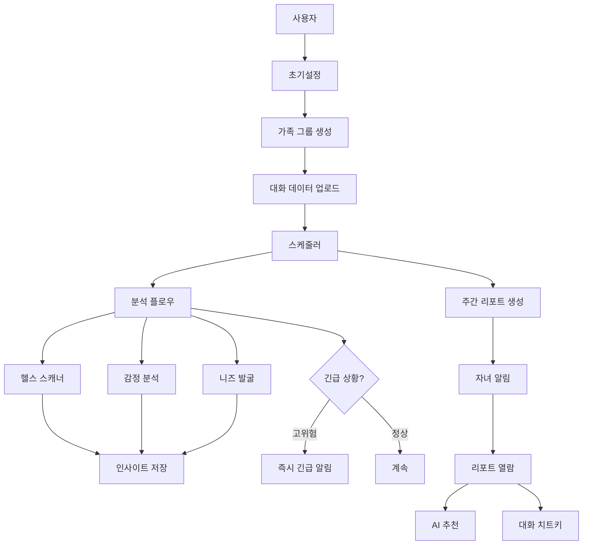

# 효도시그널 최종 구현 계획 (Mermaid 기반)

기획서 + 3개 Mermaid 플로우를 기반으로 한 최종 구현 계획입니다.

---

## 📊 전체 시스템 아키텍처



---

## 🎯 플로우 0: 초기설정 (Setup Flow)

> **Note**: Mermaid 파일은 없지만 필수 플로우로 추가

### 기능 요구사항
- 자녀가 가족 그룹 생성
- 부모 초대 (초대 코드 방식)
- 데이터 수집 동의 (F-01)
- 대화 데이터 업로드

### 도메인 모델
```java
Family {
    id: Long
    name: String
    inviteCode: String (6자리)
    createdBy: Long (자녀 userId)
    status: ACTIVE/INACTIVE
    createdAt: LocalDateTime
}

FamilyMember {
    id: Long
    familyId: Long
    userId: Long
    role: PARENT/CHILD
    nickname: String
    hasConsented: boolean
    consentedAt: LocalDateTime
    joinedAt: LocalDateTime
}

Conversation {
    id: Long
    familyId: Long
    title: String
    uploadedBy: Long
    uploadedAt: LocalDateTime
}

Message {
    id: Long
    conversationId: Long
    senderMemberId: Long
    content: String
    messageType: TEXT/IMAGE
    sentAt: LocalDateTime
}
```

### API 엔드포인트
```http
POST   /api/families                    # 가족 생성
POST   /api/families/join/{code}        # 초대 코드로 참가
POST   /api/families/{id}/consent       # 데이터 동의
POST   /api/conversations               # 대화 업로드
POST   /api/conversations/{id}/messages # 메시지 추가
GET    /api/families/my                 # 내 가족 목록
```

---

## 🎯 플로우 1: 분석 플로우 (Analysis Flow)

> **Source**: 분석.mermaid

### Mermaid 플로우 요약
```
1. 스케줄러가 매일/주간 주기적으로 실행
2. 최근 대화 로그 및 사진 조회
3. AI 엔진에 3가지 분석 요청
   - 헬스 스캐너 [F-02]
   - 마음 읽기 [F-03]
   - 숨은 니즈 [F-04]
4. 구조화된 인사이트 저장
5. 매주 금요일 리포트 생성 후 알림톡 발송 [F-05]
```

### 핵심 구현 사항

#### 1. 스케줄러 설정
```java
@Configuration
@EnableScheduling
public class SchedulerConfig {

    // 매일 자정 분석 실행
    @Scheduled(cron = "0 0 0 * * *")
    public void runDailyAnalysis() {
        analysisService.analyzeRecentConversations();
    }

    // 매주 금요일 오후 3시 리포트 생성
    @Scheduled(cron = "0 0 15 * * FRI")
    public void generateWeeklyReport() {
        reportService.generateWeeklyReports();
    }
}
```

#### 2. AI 분석 서비스 (Gemini)
```java
@Service
public class GeminiAnalysisService {

    // [F-02] 헬스 스캐너
    public HealthInsight analyzeHealth(List<Message> messages) {
        String prompt = buildHealthPrompt(messages);
        GeminiResponse response = geminiClient.generate(prompt);
        return parseHealthInsight(response);
    }

    // [F-03] 마음 읽기 (감정 분석)
    public EmotionInsight analyzeEmotion(List<Message> messages) {
        String prompt = buildEmotionPrompt(messages);
        GeminiResponse response = geminiClient.generate(prompt);
        return parseEmotionInsight(response);
    }

    // [F-04] 숨은 니즈 발굴
    public NeedsInsight analyzeNeeds(List<Message> messages) {
        String prompt = buildNeedsPrompt(messages);
        GeminiResponse response = geminiClient.generate(prompt);
        return parseNeedsInsight(response);
    }
}
```

#### 3. 프롬프트 템플릿
```java
// 헬스 스캐너 프롬프트
private String buildHealthPrompt(List<Message> messages) {
    return """
        다음은 부모님과 자녀의 대화입니다.
        부모님의 건강 상태를 분석해주세요.

        대화:
        %s

        다음 JSON 형식으로 답변:
        {
          "keywords": ["무릎", "허리", "두통"],
          "bodyParts": ["무릎", "허리"],
          "severity": "MEDIUM",
          "description": "최근 무릎 통증 호소가 증가했습니다.",
          "recommendation": "정형외과 검진을 권유하세요."
        }
        """.formatted(formatMessages(messages));
}

// 감정 분석 프롬프트
private String buildEmotionPrompt(List<Message> messages) {
    return """
        다음 대화에서 부모님의 감정 상태를 분석해주세요.

        대화:
        %s

        JSON 형식:
        {
          "emotionType": "LONELY",
          "score": 45,
          "description": "외로움을 느끼는 표현이 증가했습니다.",
          "evidence": ["혼자 있으니 심심해", "요즘 애들이 안 와"]
        }
        """.formatted(formatMessages(messages));
}

// 니즈 발굴 프롬프트
private String buildNeedsPrompt(List<Message> messages) {
    return """
        대화에서 부모님이 필요로 하는 물건이나 서비스를 찾아주세요.

        대화:
        %s

        JSON 형식:
        {
          "category": "건강",
          "items": ["온열 찜질기", "무릎 보호대"],
          "priority": "HIGH",
          "description": "무릎 통증으로 인한 건강 용품 필요",
          "giftKeywords": ["찜질기", "무릎보호대"]
        }
        """.formatted(formatMessages(messages));
}
```

#### 4. 인사이트 도메인
```java
// insight 도메인
HealthInsight {
    id: Long
    familyId: Long
    parentMemberId: Long

    // 분석 결과 (JSON 저장)
    keywords: String[] (JSON)
    bodyParts: String[] (JSON)
    severity: Severity (LOW/MEDIUM/HIGH)
    description: String
    recommendation: String

    // 분석 기간
    analyzedFrom: LocalDate
    analyzedTo: LocalDate

    createdAt: LocalDateTime
}

EmotionInsight {
    id: Long
    familyId: Long
    parentMemberId: Long

    // 분석 결과
    emotionType: EmotionType (HAPPY/NEUTRAL/SAD/LONELY/ANXIOUS)
    score: Integer (0-100)
    description: String
    evidence: String[] (JSON)

    // 분석 기간
    analyzedFrom: LocalDate
    analyzedTo: LocalDate

    createdAt: LocalDateTime
}

NeedsInsight {
    id: Long
    familyId: Long
    parentMemberId: Long

    // 분석 결과
    category: String (건강/음식/의류/취미)
    items: String[] (JSON)
    priority: Priority (HIGH/MEDIUM/LOW)
    description: String
    giftKeywords: String[] (JSON)

    // 분석 기간
    analyzedFrom: LocalDate
    analyzedTo: LocalDate

    createdAt: LocalDateTime
}
```

#### 5. API 엔드포인트
```http
# 분석 실행 (수동 트리거)
POST   /api/analysis/run/{familyId}       # 전체 분석 실행
POST   /api/analysis/health/{familyId}    # 헬스만
POST   /api/analysis/emotion/{familyId}   # 감정만
POST   /api/analysis/needs/{familyId}     # 니즈만

# 인사이트 조회
GET    /api/insights/{familyId}/health    # 건강 인사이트
GET    /api/insights/{familyId}/emotion   # 감정 인사이트
GET    /api/insights/{familyId}/needs     # 니즈 인사이트
GET    /api/insights/{familyId}/latest    # 최신 통합 인사이트
```

---

## 🎯 플로우 2: 리포트 열람 플로우 (Report View Flow)

> **Source**: 리포트_열람.mermaid

### Mermaid 플로우 요약
```
1. 자녀가 금주의 효도 리포트 상세 보기
2. [니즈 파악 & 제안]
   - AI가 건강/계절 맞춤 추천
   - "온열 찜질기" 등 선물 제안
3. [대화 소재 제안]
   - 최근 대화/사진 기반 질문거리 생성
   - "주말에 가신 등산 사진, 단풍이 참 예쁘네요" 같은 멘트
```

### 핵심 구현 사항

#### 1. 주간 리포트 도메인
```java
WeeklyReport {
    id: Long
    familyId: Long
    childMemberId: Long
    parentMemberId: Long

    // 인사이트 요약 (FK가 아닌 스냅샷)
    healthSummary: String (JSON)
    emotionSummary: String (JSON)
    needsSummary: String (JSON)

    // 종합 평가
    overallStatus: OverallStatus (GOOD/NORMAL/NEED_ATTENTION)

    // 기간
    weekStartDate: LocalDate
    weekEndDate: LocalDate

    // 상태
    isRead: boolean
    readAt: LocalDateTime

    generatedAt: LocalDateTime
}

ConversationTip {
    id: Long
    reportId: Long

    // [F-06] 대화 치트키
    tipType: TipType (PHOTO_BASED/RECENT_TOPIC/SEASONAL)
    topic: String
    suggestion: String
    context: String

    priority: Integer (1-3)
    createdAt: LocalDateTime
}

GiftRecommendation {
    id: Long
    reportId: Long
    needsInsightId: Long

    // AI 추천 선물
    productName: String
    category: String
    reason: String
    giftLink: String (카카오 선물하기 URL)

    priority: Integer
    createdAt: LocalDateTime
}
```

#### 2. 리포트 생성 서비스
```java
@Service
public class WeeklyReportService {

    // 주간 리포트 자동 생성
    @Transactional
    public WeeklyReport generateReport(Long familyId) {
        // 1. 지난 주 인사이트 조회
        LocalDate weekStart = LocalDate.now().minusWeeks(1);
        LocalDate weekEnd = LocalDate.now().minusDays(1);

        List<HealthInsight> healthInsights = insightRepository
            .findHealthByFamilyAndPeriod(familyId, weekStart, weekEnd);
        List<EmotionInsight> emotionInsights = insightRepository
            .findEmotionByFamilyAndPeriod(familyId, weekStart, weekEnd);
        List<NeedsInsight> needsInsights = insightRepository
            .findNeedsByFamilyAndPeriod(familyId, weekStart, weekEnd);

        // 2. 리포트 생성
        WeeklyReport report = WeeklyReport.builder()
            .familyId(familyId)
            .healthSummary(summarizeHealth(healthInsights))
            .emotionSummary(summarizeEmotion(emotionInsights))
            .needsSummary(summarizeNeeds(needsInsights))
            .overallStatus(calculateOverallStatus(healthInsights, emotionInsights))
            .weekStartDate(weekStart)
            .weekEndDate(weekEnd)
            .build();

        reportRepository.save(report);

        // 3. AI로 대화 치트키 생성 (3개)
        List<ConversationTip> tips = generateConversationTips(familyId, report.getId());
        conversationTipRepository.saveAll(tips);

        // 4. AI로 선물 추천
        List<GiftRecommendation> gifts = generateGiftRecommendations(needsInsights, report.getId());
        giftRecommendationRepository.saveAll(gifts);

        return report;
    }

    // AI로 대화 치트키 생성
    private List<ConversationTip> generateConversationTips(Long familyId, Long reportId) {
        // 최근 대화와 사진 조회
        List<Message> recentMessages = messageRepository.findRecentByFamily(familyId, 7);

        String prompt = """
            최근 대화와 사진을 기반으로 자녀가 부모님께 할 수 있는
            자연스러운 대화 주제 3가지를 제안해주세요.

            대화:
            %s

            JSON 배열 형식:
            [
              {
                "tipType": "PHOTO_BASED",
                "topic": "등산 사진",
                "suggestion": "주말에 가신 등산 사진, 단풍이 참 예쁘네요. 어디였어요?",
                "context": "부모님이 등산 사진을 공유하셨습니다.",
                "priority": 1
              },
              ...
            ]
            """.formatted(formatMessages(recentMessages));

        GeminiResponse response = geminiClient.generate(prompt);
        return parseTips(response, reportId);
    }

    // AI로 선물 추천
    private List<GiftRecommendation> generateGiftRecommendations(
            List<NeedsInsight> needsInsights, Long reportId) {

        String prompt = """
            다음 니즈 분석을 바탕으로 카카오 선물하기에서
            검색 가능한 구체적인 상품을 추천해주세요.

            니즈:
            %s

            JSON 배열 형식:
            [
              {
                "productName": "온열 찜질기",
                "category": "건강",
                "reason": "무릎 통증 호소가 증가했습니다.",
                "giftKeyword": "찜질기",
                "priority": 1
              },
              ...
            ]
            """.formatted(formatNeeds(needsInsights));

        GeminiResponse response = geminiClient.generate(prompt);
        return parseGiftRecommendations(response, reportId);
    }
}
```

#### 3. API 엔드포인트
```http
# 리포트 조회
GET    /api/reports/weekly/latest/{familyId}   # 최신 주간 리포트
GET    /api/reports/weekly/{familyId}          # 주간 리포트 목록
GET    /api/reports/{id}                       # 리포트 상세
POST   /api/reports/{id}/read                  # 읽음 표시

# 대화 치트키
GET    /api/reports/{id}/conversation-tips     # 대화 치트키 목록

# 선물 추천
GET    /api/reports/{id}/gift-recommendations  # 선물 추천 목록

# 수동 생성
POST   /api/reports/generate/{familyId}        # 리포트 즉시 생성
```

#### 4. Response DTO
```java
record WeeklyReportDetailResponse(
    Long reportId,
    String period,
    OverallStatus overallStatus,

    // 인사이트 요약
    HealthSummary health,
    EmotionSummary emotion,
    NeedsSummary needs,

    // 대화 치트키 (3개)
    List<ConversationTipResponse> conversationTips,

    // 선물 추천
    List<GiftRecommendationResponse> giftRecommendations,

    LocalDateTime generatedAt
) {}

record ConversationTipResponse(
    Long tipId,
    String topic,
    String suggestion,  // 복사 가능한 멘트
    String context,
    int priority
) {}

record GiftRecommendationResponse(
    Long giftId,
    String productName,
    String category,
    String reason,
    String giftLink,  // 카카오 선물하기 URL
    int priority
) {}
```

---

## 🎯 플로우 3: 긴급 리포트 플로우 (Emergency Alert Flow)

> **Source**: 긴급 리포트.mermaid

### Mermaid 플로우 요약
```
1. 스케줄러가 대화 데이터 수시 모니터링
2. AI가 위험 키워드 감지
   - "응급실", "입원", "낙상"
   - 48시간 무응답
3. 위험도 'High' 판정 시
4. 긴급 효도 리포트 즉시 생성
5. 자녀에게 알림톡 발송 🚨
```

### 핵심 구현 사항

#### 1. 긴급 알림 도메인
```java
EmergencyAlert {
    id: Long
    familyId: Long
    parentMemberId: Long
    childMemberId: Long

    // 알림 정보
    alertType: AlertType
    severity: AlertSeverity (CRITICAL/HIGH/MEDIUM)

    // 감지 내용
    triggerKeyword: String
    triggerMessageId: Long
    aiAnalysis: String (AI가 분석한 맥락)

    // 상태
    isAcknowledged: boolean
    acknowledgedAt: LocalDateTime

    createdAt: LocalDateTime
}

enum AlertType {
    HEALTH_EMERGENCY,    // 응급실, 입원, 낙상
    CONVERSATION_GAP,    // 48시간 무응답
    HIGH_PAIN_FREQUENCY, // 통증 호소 급증
    MENTAL_CONCERN       // 우울감 심화
}
```

#### 2. 긴급 키워드 감지 서비스
```java
@Service
public class EmergencyDetectionService {

    // 고위험 키워드 사전
    private static final Map<AlertType, List<String>> EMERGENCY_KEYWORDS = Map.of(
        AlertType.HEALTH_EMERGENCY, List.of(
            "응급실", "입원", "낙상", "쓰러졌", "119",
            "구급차", "응급", "위급", "중환자실"
        ),
        AlertType.MENTAL_CONCERN, List.of(
            "죽고싶", "외롭", "우울", "힘들", "포기",
            "의미없", "버려진"
        )
    );

    // 메시지 저장 시 자동 감지
    @Async
    @TransactionalEventListener
    public void onMessageCreated(MessageCreatedEvent event) {
        Message message = event.getMessage();

        // 1. 키워드 사전 체크
        AlertType detectedType = detectEmergencyKeyword(message.getContent());

        if (detectedType != null) {
            // 2. AI로 맥락 분석 (오탐 방지)
            boolean isRealEmergency = analyzeContext(message);

            if (isRealEmergency) {
                // 3. 긴급 알림 생성
                createEmergencyAlert(message, detectedType);

                // 4. 즉시 알림 전송
                sendEmergencyNotification(message.getFamilyId());
            }
        }
    }

    // AI 맥락 분석
    private boolean analyzeContext(Message message) {
        String prompt = """
            다음 메시지가 실제 긴급 상황인지 판단해주세요.

            메시지: "%s"

            JSON 형식:
            {
              "isEmergency": true/false,
              "severity": "CRITICAL/HIGH/MEDIUM",
              "reason": "판단 근거"
            }
            """.formatted(message.getContent());

        GeminiResponse response = geminiClient.generate(prompt);
        return parseEmergencyAnalysis(response);
    }

    // 대화 단절 감지 (스케줄러)
    @Scheduled(cron = "0 0 * * * *")  // 매시간
    public void checkConversationGap() {
        List<Family> families = familyRepository.findAll();

        for (Family family : families) {
            LocalDateTime lastMessageTime = messageRepository
                .findLastMessageTime(family.getId());

            if (lastMessageTime != null &&
                lastMessageTime.isBefore(LocalDateTime.now().minusHours(48))) {

                createConversationGapAlert(family.getId());
                sendEmergencyNotification(family.getId());
            }
        }
    }
}
```

#### 3. API 엔드포인트
```http
# 긴급 알림 조회
GET    /api/alerts/emergency/{familyId}    # 긴급 알림 목록
GET    /api/alerts/emergency/unread        # 미확인 알림
GET    /api/alerts/{id}                    # 알림 상세

# 알림 확인
POST   /api/alerts/{id}/acknowledge        # 알림 확인 처리

# 알림 설정
GET    /api/alerts/settings/{familyId}     # 알림 설정 조회
PUT    /api/alerts/settings/{familyId}     # 알림 설정 변경
```

---

## 🏗️ 도메인 구조 (최종)

```
spring/
├── family/              # 가족 도메인
│   ├── domain/
│   │   ├── Family.java
│   │   └── FamilyMember.java
│   ├── repository/
│   └── service/
│
├── conversation/        # 대화 도메인
│   ├── domain/
│   │   ├── Conversation.java
│   │   └── Message.java
│   ├── repository/
│   └── service/
│
├── analysis/            # AI 분석 도메인
│   ├── service/
│   │   ├── AnalysisScheduler.java
│   │   └── GeminiAnalysisService.java
│   ├── gemini/
│   │   ├── GeminiClient.java
│   │   └── GeminiProperties.java
│   └── prompt/
│       └── PromptTemplates.java
│
├── insight/             # 인사이트 도메인
│   ├── domain/
│   │   ├── HealthInsight.java
│   │   ├── EmotionInsight.java
│   │   └── NeedsInsight.java
│   ├── repository/
│   └── service/
│
├── report/              # 리포트 도메인
│   ├── domain/
│   │   ├── WeeklyReport.java
│   │   ├── ConversationTip.java
│   │   └── GiftRecommendation.java
│   ├── repository/
│   └── service/
│       └── WeeklyReportService.java
│
└── alert/               # 긴급 알림 도메인
    ├── domain/
    │   └── EmergencyAlert.java
    ├── repository/
    └── service/
        └── EmergencyDetectionService.java
```

---

## 📋 구현 우선순위 (4일 계획)

### Day 1: 기본 구조
```
✅ 1. 초기설정 플로우 (4시간)
   - Family, FamilyMember 도메인
   - 초대 코드 시스템
   - API 4개

✅ 2. 대화 데이터 (3시간)
   - Conversation, Message 도메인
   - 업로드 API
```

### Day 2: AI 분석 (핵심) ⭐
```
✅ 3. Gemini API 연동 (2시간)
   - GeminiClient 구현
   - 프롬프트 템플릿

✅ 4. 분석 플로우 (6시간)
   - 3가지 인사이트 분석
   - 스케줄러 설정
   - 인사이트 저장
```

### Day 3: 리포트
```
✅ 5. 리포트 열람 플로우 (6시간)
   - 주간 리포트 생성
   - 대화 치트키 생성 (AI)
   - 선물 추천 (AI)
   - 리포트 조회 API
```

### Day 4: 긴급 알림
```
✅ 6. 긴급 리포트 플로우 (4시간)
   - 키워드 감지
   - AI 맥락 분석
   - 즉시 알림
   - 대화 단절 감지
```

---

## 🔧 필요한 설정

### 1. Gemini API Key 발급
👉 https://aistudio.google.com/app/apikey

```properties
# application-secret.properties
gemini.api-key=YOUR_API_KEY
gemini.model=gemini-1.5-flash
gemini.api-url=https://generativelanguage.googleapis.com/v1beta/models
```

### 2. GitHub Secrets
```
GEMINI_API_KEY=your_api_key
```

### 3. build.gradle 의존성 추가
```gradle
// JSON 파싱용
implementation 'com.google.code.gson:gson:2.10.1'

// 비동기 처리
implementation 'org.springframework.boot:spring-boot-starter-webflux'
```

---

## 🚀 시작하기

어떤 방식으로 진행할까요?

**Option 1: 순서대로** (추천, 안정적)
- Day 1부터 차근차근

**Option 2: AI 먼저** (빠른 검증)
- Day 2 분석 플로우부터 시작
- 하드코딩 데이터로 테스트

**Option 3: 스켈레톤** (전체 구조)
- 모든 도메인 클래스만 먼저
- 로직은 나중에

선택해주시면 바로 시작하겠습니다! 🎉
