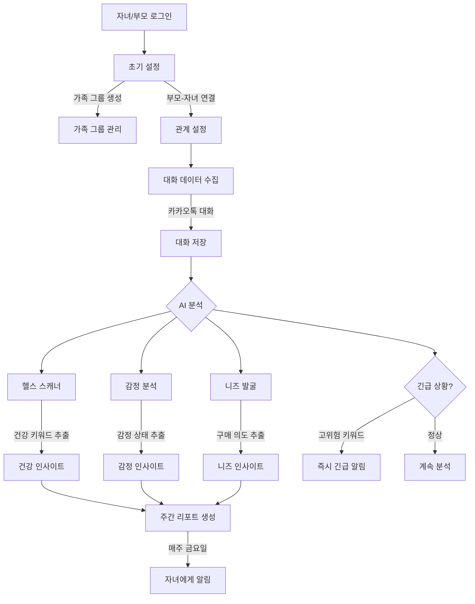

# 효도시그널 핵심 기능 구현 계획

기획안을 기반으로 한 단계별 구현 플로우입니다.

## 📊 핵심 플로우 (Mermaid)



## 🎯 단계별 구현 계획

### 📍 1단계: 가족 그룹 & 대화 데이터 도메인 (P0)

**목표**: 가족 관계와 대화 데이터를 관리하는 기본 구조 구축

**구현 항목**:
- [ ] `Family` 도메인: 가족 그룹 관리
- [ ] `FamilyMember` 도메인: 가족 구성원 관계 (부모-자녀)
- [ ] `Conversation` 도메인: 대화 데이터 저장
- [ ] `Message` 도메인: 개별 메시지 저장

**API 엔드포인트**:
```
POST   /api/families              # 가족 그룹 생성
POST   /api/families/{id}/members # 가족 구성원 추가
GET    /api/families/my           # 내 가족 목록
POST   /api/conversations         # 대화 업로드
GET    /api/conversations         # 대화 목록
```

**DB 테이블**:
- `families`: 가족 그룹
- `family_members`: 가족 구성원 (user_id, family_id, role)
- `conversations`: 대화방
- `messages`: 메시지 (conversation_id, sender_id, content, timestamp)

---

### 📍 2단계: Gemini API 연동 (P0)

**목표**: Gemini API를 사용한 AI 분석 기능 구현

**필요한 설정**:
- Gemini API Key 발급: https://aistudio.google.com/app/apikey
- application-secret.properties에 추가:
  ```properties
  gemini.api-key=${GEMINI_API_KEY}
  gemini.model=gemini-1.5-flash
  gemini.api-url=https://generativelanguage.googleapis.com/v1beta/models
  ```

**구현 항목**:
- [ ] Gemini API 클라이언트 구현
- [ ] 프롬프트 템플릿 관리
- [ ] AI 분석 서비스 (3가지)
  - 헬스 스캐너
  - 감정 분석
  - 니즈 발굴

**의존성 추가** (build.gradle):
```gradle
// Gemini API 호출용 (이미 있음)
implementation 'org.springframework.boot:spring-boot-starter-webflux'
```

---

### 📍 3단계: AI 분석 인사이트 저장 (P0)

**목표**: AI 분석 결과를 구조화하여 저장

**구현 항목**:
- [ ] `HealthInsight` 도메인: 건강 관련 인사이트
- [ ] `EmotionInsight` 도메인: 감정 인사이트
- [ ] `NeedsInsight` 도메인: 니즈 인사이트
- [ ] 분석 스케줄러 (매일 자정 실행)

**API 엔드포인트**:
```
POST   /api/analysis/health       # 헬스 분석 실행
POST   /api/analysis/emotion      # 감정 분석 실행
POST   /api/analysis/needs        # 니즈 분석 실행
GET    /api/insights/{familyId}   # 인사이트 조회
```

**DB 테이블**:
- `health_insights`: 건강 인사이트 (keywords, frequency, severity)
- `emotion_insights`: 감정 인사이트 (emotion_type, score, description)
- `needs_insights`: 니즈 인사이트 (category, items, priority)

---

### 📍 4단계: 주간 리포트 생성 (P0)

**목표**: 인사이트를 종합하여 자녀에게 전달할 리포트 생성

**구현 항목**:
- [ ] `WeeklyReport` 도메인: 주간 리포트
- [ ] 리포트 생성 서비스
- [ ] 리포트 스케줄러 (매주 금요일 오후 실행)
- [ ] 대화 치트키 생성 (Gemini API)

**API 엔드포인트**:
```
POST   /api/reports/generate      # 리포트 생성 (수동)
GET    /api/reports/weekly/latest # 최신 주간 리포트
GET    /api/reports/{id}          # 특정 리포트 조회
```

**DB 테이블**:
- `weekly_reports`: 주간 리포트 (family_id, summary, generated_at)
- `conversation_tips`: 대화 치트키 (report_id, tip, priority)

---

### 📍 5단계: 긴급 알림 시스템 (P1)

**목표**: 고위험 키워드 감지 시 즉시 알림

**구현 항목**:
- [ ] 긴급 키워드 감지 로직
- [ ] `EmergencyAlert` 도메인
- [ ] 즉시 알림 서비스

**고위험 키워드 예시**:
```
- 건강: "쓰러졌어", "119", "응급실", "입원"
- 안전: "도둑", "사고", "넘어졌어"
- 심리: "죽고싶어", "외롭다", "포기"
```

**API 엔드포인트**:
```
GET    /api/alerts/emergency      # 긴급 알림 목록
POST   /api/alerts/acknowledge    # 알림 확인
```

---

## 🔑 Gemini API 사용법

### 1. API Key 발급
1. https://aistudio.google.com/app/apikey 접속
2. "Create API key" 클릭
3. API Key 복사

### 2. API 호출 예시

**요청**:
```bash
curl -X POST \
  "https://generativelanguage.googleapis.com/v1beta/models/gemini-1.5-flash:generateContent?key=YOUR_API_KEY" \
  -H "Content-Type: application/json" \
  -d '{
    "contents": [{
      "parts": [{
        "text": "다음 대화에서 건강 관련 키워드를 추출해주세요: 엄마: 요즘 무릎이 자꾸 아파서..."
      }]
    }]
  }'
```

**응답**:
```json
{
  "candidates": [{
    "content": {
      "parts": [{
        "text": "건강 관련 키워드:\n- 무릎\n- 아파서\n중요도: 중간\n권장 조치: 정형외과 검진 권유"
      }]
    }
  }]
}
```

### 3. Gemini 모델 선택

| 모델 | 용도 | 비용 |
|------|------|------|
| `gemini-1.5-flash` | 빠른 응답, 일반 분석 | 무료 (월 1500회) |
| `gemini-1.5-pro` | 복잡한 분석, 높은 정확도 | 유료 |

권장: `gemini-1.5-flash` (무료 쿼터 충분)

---

## 📋 구현 우선순위

### Phase 1 (필수, 1주일)
1. ✅ 가족 그룹 & 대화 데이터 도메인
2. ✅ Gemini API 연동
3. ✅ AI 분석 서비스 (3가지)

### Phase 2 (핵심, 1주일)
4. 주간 리포트 생성
5. 대화 치트키 생성

### Phase 3 (추가, 선택)
6. 긴급 알림 시스템
7. 카카오 커머스 연동

---

## 🛠️ 시작 전 체크리스트

### GitHub Secrets 추가
- [ ] `GEMINI_API_KEY` 등록

### application-secret.properties 추가
```properties
# Gemini API Configuration
gemini.api-key=your_gemini_api_key_here
gemini.model=gemini-1.5-flash
gemini.api-url=https://generativelanguage.googleapis.com/v1beta/models
```

### 도메인 구조 확인
```
spring/
├── family/           # 가족 그룹 도메인 (NEW)
│   ├── domain/
│   ├── repository/
│   └── service/
├── conversation/     # 대화 도메인 (NEW)
│   ├── domain/
│   ├── repository/
│   └── service/
├── analysis/         # AI 분석 도메인 (NEW)
│   ├── service/
│   ├── dto/
│   └── gemini/      # Gemini API 클라이언트
├── insight/          # 인사이트 도메인 (NEW)
│   ├── domain/
│   ├── repository/
│   └── service/
└── report/           # 리포트 도메인 (NEW)
    ├── domain/
    ├── repository/
    └── service/
```

---

## 🎯 다음 단계

어떤 단계부터 시작할까요?

1. **1단계부터 차근차근** - 가족 그룹 & 대화 데이터 도메인 구현
2. **2단계 Gemini 연동** - AI 분석 기능 먼저 구현
3. **전체 스켈레톤** - 모든 도메인 구조만 먼저 만들기

선택해주시면 해당 단계부터 구현하겠습니다!
